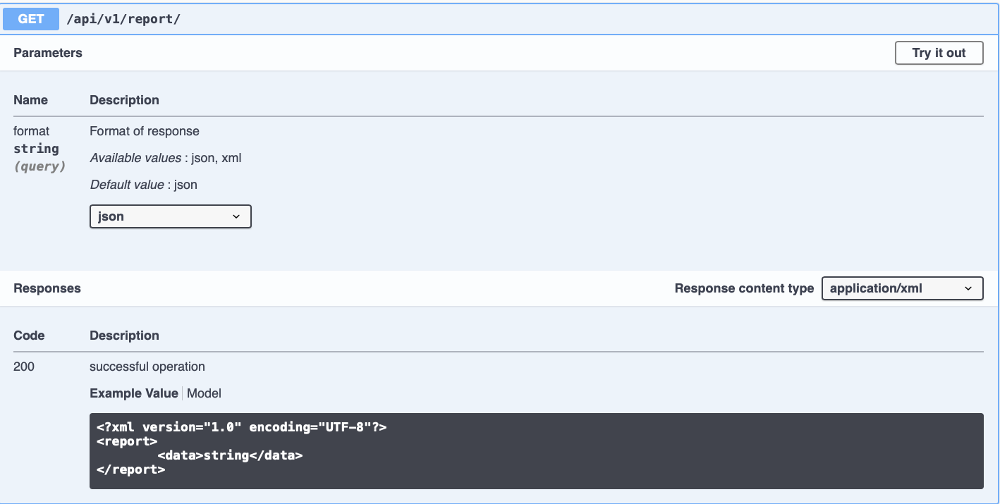
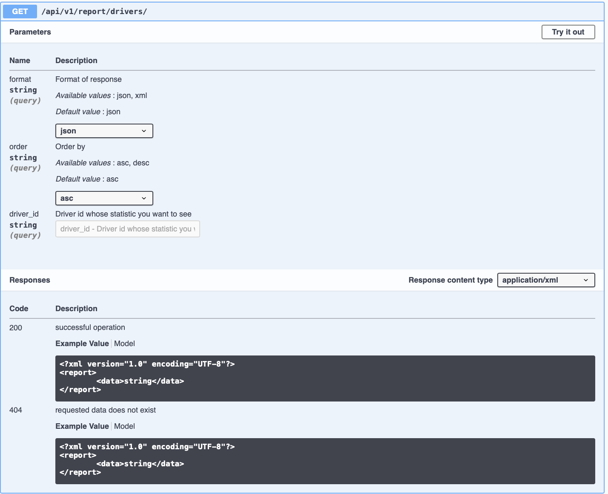

# Flask REST-API application

This application based on my python package 
[Report_pkg](https://github.com/karpenkotakeoff/report_pkg). I moved some functions from this package to utils.py. I Used them for parsing data to 
database, instead printing data to the screen.

You can get a qualification report by sending GET request to ```/api/v1/report```



Supported two formats XML and JSON.

If you want to get information about the pilots, you can to make a request to 
```/api/v1/report/drivers/``` with some optional arguments



Thanks for your time :)